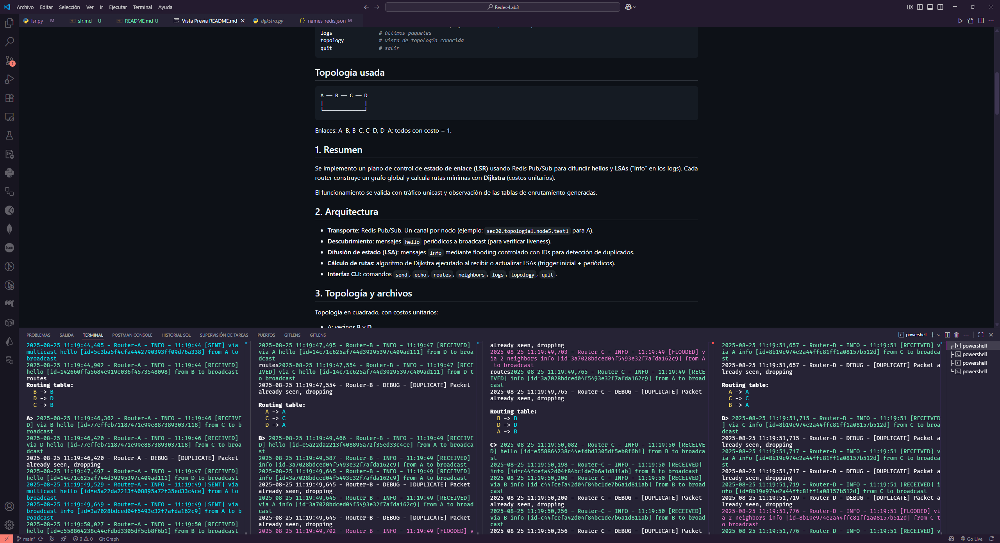

# Laboratorio 3 — Algoritmos de Enrutamiento — Parte 1

- **Irving Acosta 22781**
- **Daniel Rayo 22933**
- **Josué Say 22801**

## Resumen

Este documento presenta la Parte 1 del Laboratorio 3 — implementación y pruebas locales de algoritmos de enrutamiento sobre sockets y Redis.
Se cubren el objetivo del laboratorio, la implementación de **Flooding** como mecanismo de reenvío básico, así como la integración y validación de **Link State Routing (LSR) sobre Redis Pub/Sub**, que incluye el intercambio de *hellos*, difusión de *LSAs* y cálculo de rutas mediante el algoritmo de **Dijkstra**.
Se muestran las pruebas en topologías en lazo (A–B–C–D), evidenciando robustez frente a duplicados, cálculo correcto de rutas y envío unicast exitoso.

## Requisitos

- Python 3.10+
- Servidor Redis accesible
- Paquetes Python listados en `requirements.txt`

## Objetivos

- Comprender y aplicar algoritmos de enrutamiento en una red simulada localmente.
- Implementar y probar los mecanismos de *forwarding* y *routing* (Flooding como entregable principal de esta Parte 1).
- Validar la implementación de **LSR sobre Redis Pub/Sub**, verificando la propagación de LSAs y el cálculo de rutas mínimas.
- Evaluar el comportamiento (estabilidad, duplicados en Flooding, TTL, descubrimiento de vecinos, cálculo de rutas óptimas) en topologías con bucles.

## Requerimientos y formato de los archivos

Se siguió el formato de configuración requerido por la práctica: archivo de topología (tipo `topo-*.txt` / JSON) y archivo de asignación de nombres (`names-*.txt` / JSON). Estos archivos son exclusivamente para configurar el nodo y descubrir vecinos, según especifica el enunciado.

## 3. Diseño e implementación

### 3.1 Estructura general

Cada nodo se implementa como un proceso Python que mantiene dos responsabilidades en paralelo:

- **Forwarding**: escucha sockets y reenvía paquetes (o los consume si son para el propio nodo).
- **Routing**: mantiene la lógica del algoritmo de enrutamiento (en este entregable: Flooding; Dijkstra implementado en el repositorio pero estático).

Esto sigue la separación sugerida en el enunciado para los hilos de *forwarding* y *routing*.

### 3.2 Paquete / protocolo

El formato de mensaje usa JSON con campos mínimos: `proto`, `type`, `from`, `to`, `ttl`, `headers` y `payload`. Se utilizaron los tipos `hello`, `echo`, `echo_reply`, `message` y `info/lsa` para futuras ampliaciones. El `ttl` se decrementa en cada salto y los paquetes con `ttl = 0` se descartan.

### 3.3 Flooding — detalles implementados

Implementación de Flooding en el repositorio:

- Cada paquete que se va a *floodear* recibe un `headers['msg_id']` estable (UUID) para identificar mensajes únicos.
- El router mantiene una caché simple LRU de IDs vistos (`_rx_seen_ids` y `_rx_seen_fifo`) para filtrar duplicados; capacidad configurable (por defecto 50k entradas).
- Al recibir un paquete Flooding, el nodo verifica si el `msg_id` ya fue visto — si sí, lo descarta; si no, lo procesa y lo reenvía a todos los vecinos excepto la interfaz de llegada.
- Se implementaron mecanismos de *hello* periódicos para descubrimiento de vecinos y para detección de enlaces caídos.

**Nota sobre la “LRU cache”:** en el código la estructura usada es un conjunto (`set`) con una `deque` que actúa como cola para expulsar IDs antiguos cuando se alcanza la capacidad; esto implementa funcionalmente una caché LRU simplificada (set+deque). En documentos o discusiones previas a menudo se la denomina caché LRU, y aquí se usa para evitar re-propagación infinita de mensajes en topologías con bucles.

### 3.4 Prevención de reenvíos infinitos / TTL

- Cada paquete tiene TTL inicial (por defecto 5). Antes de reenviarlo se decrementa y si llega a 0 se descarta.
- La combinación de `msg_id` (deduplicación) + TTL evita tormentas de Flooding en topologías cíclicas.

## 4. Pruebas realizadas

### 4.1 Topología de prueba

Se probó la topología con 4 nodos formando un lazo (A–B–C–D–A). El repositorio incluye `topo_loop.json` y `names_loop.json` para reproducir las pruebas.

### 4.2 Escenarios y observaciones

- **Descubrimiento de vecinos:** los nodos envían *hello* periódicos y los vecinos aceptan conexiones TCP; se observa reconexión automática al fallar enlaces.
- **Echo / mensaje unicast sobre Flooding:** al enviar *echo* desde A hacia C el paquete es *flood-eado* por A a B y D; C recibe y responde con *echo_reply* que regresa a A (también *flood-eada* y deduplicada con `msg_id`).
- **Duplicados controlados:** la caché de `msg_id` impide que un mismo paquete se procese más de una vez por nodo.

*(Para los registros de ejecución y trazas, ver logs de ejecución y el historial de router.log en el repositorio — se recomiendan fragmentos de log como evidencia en la sección de Resultados.)*

## 5. Resultados

- Flooding funciona y entrega *echo* y *echo_reply* en la topología con bucle.
- La deduplicación por `msg_id` y TTL evitan re-propagación indefinida.
- El descubrimiento de vecinos y reintento de conexiones muestran robustez básica frente a conexiones intermitentes.
- Se hicieron además pruebas preliminares de LSR que muestran propagación de LSAs y cálculo de rutas, pero los resultados completos se dejarán para la Parte 2.

## 6. Link State Routing

Se implementó un plano de control de **estado de enlace (LSR)** usando Redis Pub/Sub para difundir **hellos** y **LSAs** (“info” en los logs).
Cada router construye un grafo global y calcula rutas mínimas con **Dijkstra** (costos unitarios).

El funcionamiento se valida con tráfico unicast y observación de las tablas de enrutamiento generadas.

### Ejecución

Se debe abrir una terminal por nodo y ejecutar:

```bash
python main.py --id A --algorithm lsr --mode redis --topo topo.json --names names-redis.json
python main.py --id B --algorithm lsr --mode redis --topo topo.json --names names-redis.json
python main.py --id C --algorithm lsr --mode redis --topo topo.json --names names-redis.json
python main.py --id D --algorithm lsr --mode redis --topo topo.json --names names-redis.json
```

### Comandos interactivos disponibles

```bash
send <dest> <msg>   # unicast
echo <dest>         # ping de aplicación
neighbors           # vecinos directos (topología local)
routes              # tabla de enrutamiento (siguiente salto por destino)
logs                # últimos paquetes
topology            # vista de topología conocida
quit                # salir
```

### Topología usada

```bash
A ── B ── C ── D
|              |
└──────────────┘
```

Enlaces: A–B, B–C, C–D, D–A; todos con costo = 1.

### Arquitectura

- **Transporte:** Redis Pub/Sub. Un canal por nodo (ejemplo: `sec20.topologia1.node5.test1` para A).
- **Descubrimiento:** mensajes `hello` periódicos a broadcast (para verificar liveness).
- **Difusión de estado (LSA):** mensajes `info` mediante flooding controlado con IDs para detección de duplicados.
- **Cálculo de rutas:** algoritmo de Dijkstra ejecutado al recibir o actualizar LSAs (trigger inicial + periódicos).
- **Interfaz CLI:** comandos `send`, `echo`, `routes`, `neighbors`, `logs`, `topology`, `quit`.

### Topología y archivos

Topología en cuadrado, con costos unitarios:

- A: vecinos **B** y **D**
- B: vecinos **A** y **C**
- C: vecinos **B** y **D**
- D: vecinos **A** y **C**

Confirmación al iniciar:

- **A**: `Loaded topology: A -> ['B', 'D']`
- **B**: `Loaded topology: B -> ['A', 'C']`
- **C**: `Loaded topology: C -> ['B', 'D']`
- **D**: `Loaded topology: D -> ['A', 'C']`

### Flujo de paquetes

#### Arranque y suscripción

Ejemplo (A):

```bash
Router A started with Redis pub/sub
Subscribed to channels: ['...test4','...test1','...test2']
```

El router escucha su propio canal y los de sus vecinos.

#### Hello + LSA (flooding con supresión de duplicados)

- Emisión y recepción en A:

  - `[SENT] via multicast hello ... from A to broadcast`
  - `[SENT] via broadcast info ... from A to broadcast`
  - `[RECEIVED] via B info [...]` + `[DUPLICATE] Packet already seen, dropping`
  - `[FLOODED] via 2 neighbors info [...]`

Esto se repite en todos los nodos, demostrando que:

1. El flooding llega por múltiples caminos.
2. Los duplicados se eliminan correctamente.

#### Cálculo de rutas (tablas)

Después de estabilizar:

- **A**

    ```bash
    B -> B
    D -> D
    C -> B
    ```

- **B**

    ```bash
    A -> A
    C -> C
    D -> A
    ```

- **C**

    ```bash
    B -> B
    D -> D
    A -> B
    ```

**Interpretación:**
Con costos unitarios, los caminos mínimos entre nodos no vecinos tienen costo 2 y pueden existir empates. El sistema aplica una política determinista de desempate (por ejemplo, primer vecino conocido o ID más bajo).

#### Unicast end-to-end

- **A -> D**
  
    `send D HOLA D` → recibido en D: `Message received: HOLA D`

    (Ruta A–D directa, consistente con la tabla).

- **D -> A**

    Mensaje recibido en A: `QUE TAL A`
  
    (Ruta D–A directa).

- **C <-> B**
  
    Intercambio directo de mensajes, consistente con las tablas (`B->B`, `C->C`).

#### Salida

Al ejecutar `quit`:

```bash
Message reader cancelled
Periodic tasks cancelled
Warning: Cleanup operation timed out or failed
Redis router X stopped
```

El cierre es correcto, aunque alguna tarea asincrónica puede no finalizar a tiempo.

### Construcción de la tabla

1. **Carga de topología local**: cada router inicia con sus vecinos directos.
2. **Difusión de estado**: periódicamente se emiten `hello` y `info`.
3. **Base de datos LSDB**: los mensajes `info` actualizan el grafo y se marcan por ID.
4. **Ejecución de Dijkstra**: se activa en arranque y tras cambios.
5. **Instalación de tabla (FIB)**: se determinan los siguientes saltos.

En empates, se aplica una política determinista. La evidencia muestra que siempre se elige el mismo vecino.

### Observaciones de operación

- Los mensajes `[DUPLICATE]` son normales debido al flooding bidireccional.
- Puede aparecer `Unknown command` si el prompt se mezcla con logs. Opciones:

  - Aumentar intervalo de `hello/info`.
  - Reducir el nivel de logs en consola.
  - Redirigir logs a archivo.

### Evidencia

- Flooding y duplicados en A:
  
    `[RECEIVED] via B info [...]` + `[DUPLICATE] Packet already seen, dropping`
  
    `[FLOODED] via 2 neighbors info [...]`

- Unicast A->D:

    `A: [FORWARDED] via D message [...] from A to D`

    `D: Message received: HOLA D`

- Tablas de rutas (ejemplo A):

    ```bash
    B -> B
    D -> D
    C -> B
    ```



## 7. Discusión y mejoras propuestas

- **Flooding** garantiza entrega incluso sin tablas de enrutamiento, pero genera tráfico redundante.
- **LSR sobre Redis** reduce el overhead al instalar rutas explícitas, a costa de mayor complejidad en el cálculo y sincronización.
- En la topología probada, se observó que:

  - Flooding entrega mensajes con duplicados controlados.
  - LSR entrega mensajes unicast en un solo camino óptimo, con menos sobrecarga de red.

## 8. Conclusiones

La Parte 1 cumple el objetivo principal: demostrar que la estrategia de **Flooding** es funcional y robusta en topologías pequeñas y con bucles, siempre y cuando exista deduplicación y TTL.

Adicionalmente, se implementó un plano de control de **Link State Routing (LSR) sobre Redis Pub/Sub**, validando que:

- Los nodos pueden descubrir vecinos y difundir LSAs de manera confiable.
- La base de datos de estado de enlace (LSDB) converge en todos los nodos.
- El algoritmo de Dijkstra permite calcular tablas de enrutamiento consistentes.
- Los mensajes unicast llegan correctamente al destino usando las rutas mínimas.

Esto demuestra que el sistema puede escalar hacia un enrutamiento más eficiente que Flooding, preparando el terreno para las siguientes fases del laboratorio.

## 9. Referencias

- GeeksforGeeks. *Unicast Routing – Link State Routing*: explicación de LSA y cálculo de rutas usando Dijkstra. ([geeksforgeeks.org][1])
- GeeksforGeeks. *Difference between Distance Vector Routing and Link State Routing*: contrasta los protocolos con enfoque en flooding y convergencia. ([geeksforgeeks.org][2])
- Wikipedia. *Link-state routing protocol*: descripción general, flooding con secuencia, LSDB y SPF. ([en.wikipedia.org][3])

[1]: https://www.geeksforgeeks.org/computer-networks/unicast-routing-link-state-routing/ "Unicast Routing - Link State Routing"
[2]: https://www.geeksforgeeks.org/computer-networks/difference-between-distance-vector-routing-and-link-state-routing/ "Difference between Distance vector routing and Link State ..."
[3]: https://en.wikipedia.org/wiki/Link-state_routing_protocol "Link-state routing protocol"
