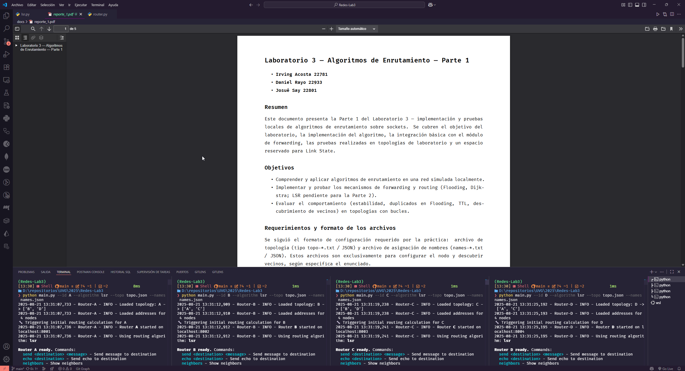

# Laboratorio 3 — Algoritmos de Enrutamiento — Parte 1

- **Irving Acosta 22781**
- **Daniel Rayo 22933**
- **Josué Say 22801**

## Resumen

Este documento presenta la Parte 1 del Laboratorio 3 — implementación y pruebas locales de algoritmos de enrutamiento sobre sockets. Se cubren el objetivo del laboratorio, la implementación del algoritmo, la integración básica con el módulo de *forwarding*, las pruebas realizadas en topologías de laboratorio y un espacio reservado para Link State.

## Objetivos

- Comprender y aplicar algoritmos de enrutamiento en una red simulada localmente.
- Implementar y probar los mecanismos de *forwarding* y *routing* (Flooding como entregable principal de esta Parte 1).
- Avanzar con pruebas preliminares de LSR, aunque su evaluación formal corresponde a la Parte 2.
- Evaluar el comportamiento (estabilidad, duplicados en Flooding, TTL, descubrimiento de vecinos) en topologías con bucles.

## Requerimientos y formato de los archivos

Se siguió el formato de configuración requerido por la práctica: archivo de topología (tipo `topo-*.txt` / JSON) y archivo de asignación de nombres (`names-*.txt` / JSON). Estos archivos son exclusivamente para configurar el nodo y descubrir vecinos, según especifica el enunciado.

## 3. Diseño e implementación

### 3.1 Estructura general

Cada nodo se implementa como un proceso Python que mantiene dos responsabilidades en paralelo:

- **Forwarding**: escucha sockets y reenvía paquetes (o los consume si son para el propio nodo).
- **Routing**: mantiene la lógica del algoritmo de enrutamiento (en este entregable: Flooding; Dijkstra implementado en el repositorio pero estático).

Esto sigue la separación sugerida en el enunciado para los hilos de *forwarding* y *routing*.

### 3.2 Paquete / protocolo

El formato de mensaje usa JSON con campos mínimos: `proto`, `type`, `from`, `to`, `ttl`, `headers` y `payload`. Se utilizaron los tipos `hello`, `echo`, `echo_reply`, `message` y `info/lsa` para futuras ampliaciones. El `ttl` se decrementa en cada salto y los paquetes con `ttl = 0` se descartan.

### 3.3 Flooding — detalles implementados

Implementación de Flooding en el repositorio:

- Cada paquete que se va a *floodear* recibe un `headers['msg_id']` estable (UUID) para identificar mensajes únicos.
- El router mantiene una caché simple LRU de IDs vistos (`_rx_seen_ids` y `_rx_seen_fifo`) para filtrar duplicados; capacidad configurable (por defecto 50k entradas).
- Al recibir un paquete Flooding, el nodo verifica si el `msg_id` ya fue visto — si sí, lo descarta; si no, lo procesa y lo reenvía a todos los vecinos excepto la interfaz de llegada.
- Se implementaron mecanismos de *hello* periódicos para descubrimiento de vecinos y para detección de enlaces caídos.

**Nota sobre la “LRU cache”:** en el código la estructura usada es un conjunto (`set`) con una `deque` que actúa como cola para expulsar IDs antiguos cuando se alcanza la capacidad; esto implementa funcionalmente una caché LRU simplificada (set+deque). En documentos o discusiones previas a menudo se la denomina caché LRU, y aquí se usa para evitar re-propagación infinita de mensajes en topologías con bucles.

### 3.4 Prevención de reenvíos infinitos / TTL

- Cada paquete tiene TTL inicial (por defecto 5). Antes de reenviarlo se decrementa y si llega a 0 se descarta.
- La combinación de `msg_id` (deduplicación) + TTL evita tormentas de Flooding en topologías cíclicas.

## 4. Pruebas realizadas

### 4.1 Topología de prueba

Se probó la topología con 4 nodos formando un lazo (A–B–C–D–A). El repositorio incluye `topo_loop.json` y `names_loop.json` para reproducir las pruebas.

### 4.2 Escenarios y observaciones

- **Descubrimiento de vecinos:** los nodos envían *hello* periódicos y los vecinos aceptan conexiones TCP; se observa reconexión automática al fallar enlaces.
- **Echo / mensaje unicast sobre Flooding:** al enviar *echo* desde A hacia C el paquete es *flood-eado* por A a B y D; C recibe y responde con *echo_reply* que regresa a A (también *flood-eada* y deduplicada con `msg_id`).
- **Duplicados controlados:** la caché de `msg_id` impide que un mismo paquete se procese más de una vez por nodo.

*(Para los registros de ejecución y trazas, ver logs de ejecución y el historial de router.log en el repositorio — se recomiendan fragmentos de log como evidencia en la sección de Resultados.)*

## 5. Resultados (resumen)

- Flooding funciona y entrega *echo* y *echo_reply* en la topología con bucle.
- La deduplicación por `msg_id` y TTL evitan re-propagación indefinida.
- El descubrimiento de vecinos y reintento de conexiones muestran robustez básica frente a conexiones intermitentes.
- Se hicieron además pruebas preliminares de LSR que muestran propagación de LSAs y cálculo de rutas, pero los resultados completos se dejarán para la Parte 2.

## 6. Link State Routing (avance preliminar)

Aunque originalmente estaba reservado para la Parte 2, se realizaron pruebas preliminares del algoritmo LSR. Los resultados aquí mostrados son solo de validación inicial (hello, LSAs, cálculo de rutas), no forman parte del entregable oficial de esta primera parte.

- Cada router envía mensajes **hello** a sus vecinos para mantener conectividad.
- Se generan y propagan mensajes **LSA (Link State Advertisement)**, que son difundidos en la red mediante broadcast.
- Cada router mantiene una **base de datos de estados de enlace (LSDB)** que se actualiza conforme llegan LSAs de otros nodos.
- Al acumular suficiente información, se ejecuta **Dijkstra** para calcular las rutas óptimas hacia todos los destinos.

En la topología en lazo (A–B–C–D–A) se observó:

- Conexión estable entre vecinos después de algunos intentos de reconexión iniciales.
- Circulación periódica de *hello* y LSAs entre todos los nodos.
- Rutas calculadas correctamente con `routes`, mostrando que cada nodo aprende el camino más corto hacia todos los demás.
- Envío exitoso de mensajes unicast (`send <destino> <msg>`) desde un nodo a otro, reenviados según la tabla de enrutamiento construida.

## 7. Discusión y mejoras propuestas

- Mejorar la caché LRU: actualmente es set+deque; podría cambiarse a `collections.OrderedDict` o `functools.lru_cache` según necesidades de memoria/eficiencia.
- Añadir métricas de performance (tiempos de entrega, conteo de retransmisiones por mensaje) para cuantificar la sobrecarga de Flooding.
- Implementar un modo híbrido (Flooding controlado + *forward path caching*) para reducir overhead en redes mayores.

## 8. Conclusiones

La Parte 1 cumple el objetivo principal: demostrar que la estrategia de Flooding es funcional y robusta en topologías pequeñas y con bucles, siempre y cuando exista deduplicación y TTL. Además, se adelantaron pruebas preliminares de LSR que confirman la correcta propagación de LSAs y el cálculo de rutas, aunque su análisis completo se abordará en la Parte 2.

## 9. Referencias

- GeeksforGeeks. *Unicast Routing – Link State Routing*: explicación de LSA y cálculo de rutas usando Dijkstra. ([geeksforgeeks.org][1])
- GeeksforGeeks. *Difference between Distance Vector Routing and Link State Routing*: contrasta los protocolos con enfoque en flooding y convergencia. ([geeksforgeeks.org][2])
- Wikipedia. *Link-state routing protocol*: descripción general, flooding con secuencia, LSDB y SPF. ([en.wikipedia.org][3])

## Anexos

- Fragmentos de `topo_loop.json` y `names_loop.json`.
- Extractos de logs (stdout) que evidencien los tests realizados.

[1]: https://www.geeksforgeeks.org/computer-networks/unicast-routing-link-state-routing/ "Unicast Routing - Link State Routing"
[2]: https://www.geeksforgeeks.org/computer-networks/difference-between-distance-vector-routing-and-link-state-routing/ "Difference between Distance vector routing and Link State ..."
[3]: https://en.wikipedia.org/wiki/Link-state_routing_protocol "Link-state routing protocol"
