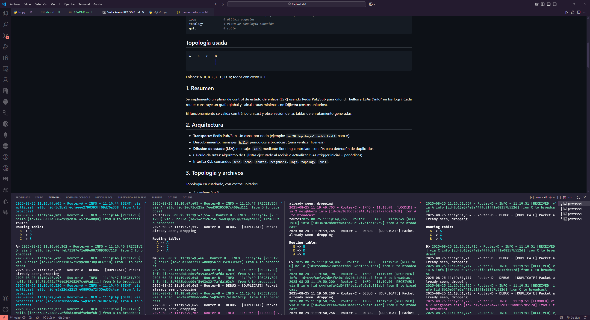

# Router LSR sobre Redis (Topología A–B–C–D)

Este proyecto implementa un plano de control simple con **Link State Routing (LSR)** sobre **Redis Pub/Sub**.
Cada router (A, B, C, D) mantiene su tabla de enrutamiento calculada con Dijkstra a partir de LSAs difundidos por flooding.

## Requisitos

- Python 3.10+
- Servidor Redis accesible (ejemplo: `lab3.redesuvg.cloud:6379`)
- Paquetes Python listados en `requirements.txt`

## Ejecución

Se debe abrir una terminal por nodo y ejecutar:

```bash
python main.py --id A --algorithm lsr --mode redis --topo topo.json --names names-redis.json
python main.py --id B --algorithm lsr --mode redis --topo topo.json --names names-redis.json
python main.py --id C --algorithm lsr --mode redis --topo topo.json --names names-redis.json
python main.py --id D --algorithm lsr --mode redis --topo topo.json --names names-redis.json
```

### Comandos interactivos disponibles

```bash
send <dest> <msg>   # unicast
echo <dest>         # ping de aplicación
neighbors           # vecinos directos (topología local)
routes              # tabla de enrutamiento (siguiente salto por destino)
logs                # últimos paquetes
topology            # vista de topología conocida
quit                # salir
```

## Topología usada

```bash
A ── B ── C ── D
|              |
└──────────────┘
```

Enlaces: A–B, B–C, C–D, D–A; todos con costo = 1.

## 1. Resumen

Se implementó un plano de control de **estado de enlace (LSR)** usando Redis Pub/Sub para difundir **hellos** y **LSAs** (“info” en los logs).
Cada router construye un grafo global y calcula rutas mínimas con **Dijkstra** (costos unitarios).

El funcionamiento se valida con tráfico unicast y observación de las tablas de enrutamiento generadas.

## 2. Arquitectura

- **Transporte:** Redis Pub/Sub. Un canal por nodo (ejemplo: `sec20.topologia1.node5.test1` para A).
- **Descubrimiento:** mensajes `hello` periódicos a broadcast (para verificar liveness).
- **Difusión de estado (LSA):** mensajes `info` mediante flooding controlado con IDs para detección de duplicados.
- **Cálculo de rutas:** algoritmo de Dijkstra ejecutado al recibir o actualizar LSAs (trigger inicial + periódicos).
- **Interfaz CLI:** comandos `send`, `echo`, `routes`, `neighbors`, `logs`, `topology`, `quit`.

## 3. Topología y archivos

Topología en cuadrado, con costos unitarios:

- A: vecinos **B** y **D**
- B: vecinos **A** y **C**
- C: vecinos **B** y **D**
- D: vecinos **A** y **C**

Confirmación al iniciar:

- **A**: `Loaded topology: A -> ['B', 'D']`
- **B**: `Loaded topology: B -> ['A', 'C']`
- **C**: `Loaded topology: C -> ['B', 'D']`
- **D**: `Loaded topology: D -> ['A', 'C']`

## 4. Flujo de paquetes

### 4.1. Arranque y suscripción

Ejemplo (A):

```bash
Router A started with Redis pub/sub
Subscribed to channels: ['...test4','...test1','...test2']
```

El router escucha su propio canal y los de sus vecinos.

### 4.2. Hello + LSA (flooding con supresión de duplicados)

- Emisión y recepción en A:

  - `[SENT] via multicast hello ... from A to broadcast`
  - `[SENT] via broadcast info ... from A to broadcast`
  - `[RECEIVED] via B info [...]` + `[DUPLICATE] Packet already seen, dropping`
  - `[FLOODED] via 2 neighbors info [...]`

Esto se repite en todos los nodos, demostrando que:

1. El flooding llega por múltiples caminos.
2. Los duplicados se eliminan correctamente.

### 4.3. Cálculo de rutas (tablas)

Después de estabilizar:

- **A**

    ```bash
    B -> B
    D -> D
    C -> B
    ```

- **B**

    ```bash
    A -> A
    C -> C
    D -> A
    ```

- **C**

    ```bash
    B -> B
    D -> D
    A -> B
    ```

**Interpretación:**
Con costos unitarios, los caminos mínimos entre nodos no vecinos tienen costo 2 y pueden existir empates. El sistema aplica una política determinista de desempate (por ejemplo, primer vecino conocido o ID más bajo).

### 4.4. Unicast end-to-end

- **A -> D**
  
    `send D HOLA D` → recibido en D: `Message received: HOLA D`

    (Ruta A–D directa, consistente con la tabla).

- **D -> A**

    Mensaje recibido en A: `QUE TAL A`
  
    (Ruta D–A directa).

- **C <-> B**
  
    Intercambio directo de mensajes, consistente con las tablas (`B->B`, `C->C`).

### 4.5. Salida

Al ejecutar `quit`:

```bash
Message reader cancelled
Periodic tasks cancelled
Warning: Cleanup operation timed out or failed
Redis router X stopped
```

El cierre es correcto, aunque alguna tarea asincrónica puede no finalizar a tiempo.

## 5. Construcción de la tabla (vista de código)

1. **Carga de topología local**: cada router inicia con sus vecinos directos.
2. **Difusión de estado**: periódicamente se emiten `hello` y `info`.
3. **Base de datos LSDB**: los mensajes `info` actualizan el grafo y se marcan por ID.
4. **Ejecución de Dijkstra**: se activa en arranque y tras cambios.
5. **Instalación de tabla (FIB)**: se determinan los siguientes saltos.

En empates, se aplica una política determinista. La evidencia muestra que siempre se elige el mismo vecino.

## 6. Observaciones de operación

- Los mensajes `[DUPLICATE]` son normales debido al flooding bidireccional.
- Puede aparecer `Unknown command` si el prompt se mezcla con logs. Opciones:

  - Aumentar intervalo de `hello/info`.
  - Reducir el nivel de logs en consola.
  - Redirigir logs a archivo.

## 7. Evidencia (extractos)

- Flooding y duplicados en A:
  
    `[RECEIVED] via B info [...]` + `[DUPLICATE] Packet already seen, dropping`
  
    `[FLOODED] via 2 neighbors info [...]`

- Unicast A->D:

    `A: [FORWARDED] via D message [...] from A to D`

    `D: Message received: HOLA D`

- Tablas de rutas (ejemplo A):

    ```bash
    B -> B
    D -> D
    C -> B
    ```


